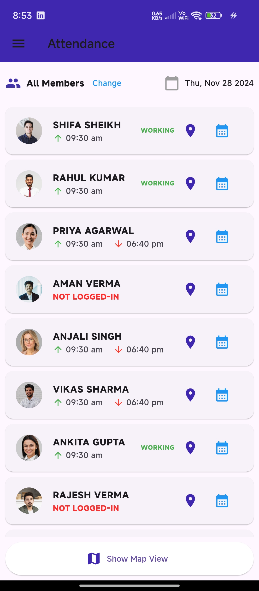
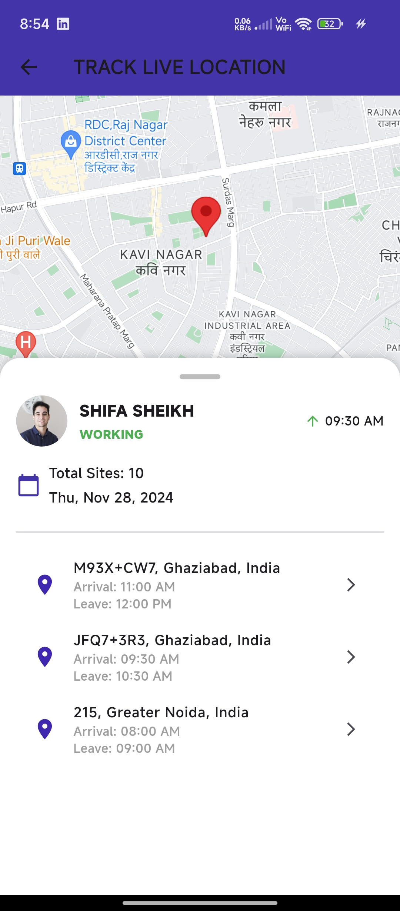
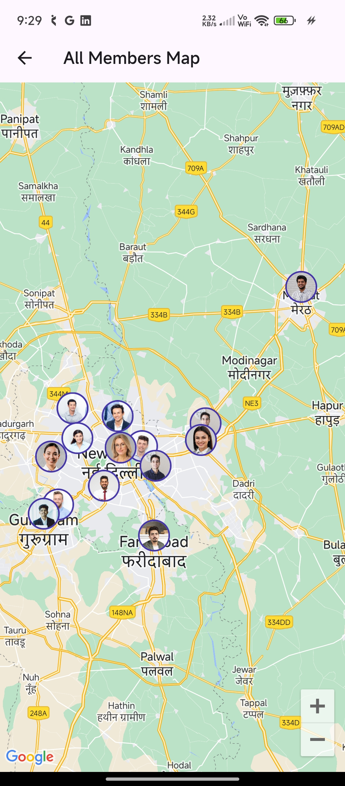
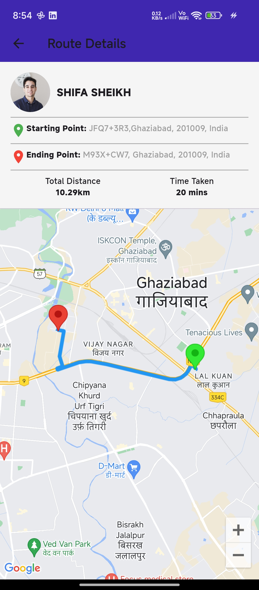
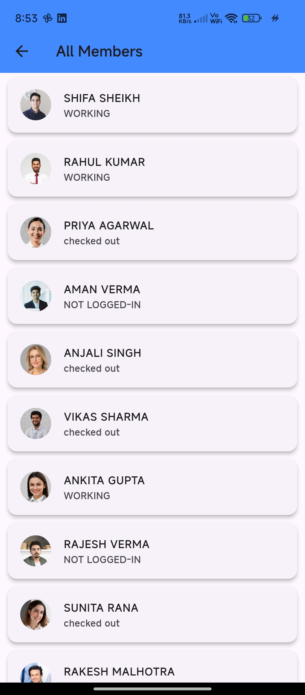

# Location Tracker - Flutter App

Location Tracker - Flutter App
This project is a Location Tracking System developed using the Flutter Framework. The app allows users to monitor and visualize the attendance and travel routes of members. The main features include viewing current locations, timelines of visited locations, and detailed route information.

## Features Implemented
1. Attendance with Location Tracking
Accessed from the Menu by clicking on the Attendance section.
Displays a list of members with two action icons:
Current Location: View a member's current location on a map.
Route Traveled: Visualize the route traveled by a member.

2. Member Location Overview
Clicking the location icon for a member:
Opens a Map Screen displaying the current location of the selected member.
Includes a Timeline View at the bottom:
Displays all visited locations for the current day (default view).
Includes a Date Filter to view data for specific past dates.
The timeline can be expanded to see a full list of traveled locations.

3. Route Details
Selecting any two visited locations generates detailed route information:
Start Location and Stop Location.
Total Distance Traveled (in kilometers).
Total Travel Duration.
A Map View:
Displays the complete route drawn on Google Maps.
Red Dots on the route line indicate stops:
Any stop exceeding 10 minutes is recorded as Stop Time.
This provides a visual summary of the member's travel history.

## File Structure
```
.
├── android/                     # Android-specific files
├── ios/                         # iOS-specific files
├── lib/                         # Main Dart code directory
│   ├── assets/                  # contain all assets
|	├──image/                # contain all images
│   ├── member.dart              # Model class for Member
│   ├── homescreen.dart          # Display the staus and some details of members
│   ├── route_screen.dart        # Display the route of visited locations
│   ├── mapscreen.dart           # Display all members current or last location
│   ├── member_screen.dart       # UI for the member list and actions
│   ├── location_screen.dart     # Displays location of individual member
│   ├── main.dart                # Entry point for the Flutter app
├── test/                        # Unit and widget tests
├── pubspec.yaml                 # Project dependencies and asset declarations
└── README.md                    # This readme file
```
## File Details
1. lib/main.dart: This is the entry point of the application. It initializes the app and routes to the MemberScreen.

2. lib/member.dart: Contains the Member class, which defines the properties of each member, including their name, current location (as LatLng coordinates), and attendance 
   records.
   
3.lib/homescreen.dart:Displays a list of members with there current status, each with two actions:
    a. View location and route traveled.
    b. View and manage attendance.
   
4. lib/member_screen.dart: Displays a list of members.
   
5. lib/location_screen.dart: Displays the current location or last location on Google Maps, with a timeline view of all visited locations.
   
6. lib/route_screen.dart: The map shows the start/stop points and indicates stop times on the route with the timetaken and total distence.
   
7. lib/mapscreen.dart: Show all members current location or last location of all members.

## Screenshots

### 1. Home Screen


### 2. Location Screen


### 3. Map Screen


### 4. Route Screen


### 5. Members Screen



## Installation

1. Clone the Repository:


```bash
git clone https://github.com/<your-repo-name>.git

```
2. Navigate to the Project Directory:


```bash
  cd VENOVE_ASSIGNEMENT
```

3. Install Dependencies:
```bash
 flutter pub get
```

4. Add your Your_API_KEY 
```bash
-> android/app/src/main/AndroidManifest
 
   <meta-data
    android:name="com.google.android.geo.API_KEY"
    android:value="Your_API_KEY" />

-> lib/route_screen.dart/_RouteScreenState/_fetchRoute

   Future<void> _fetchRoute() async {
    const apiKey = 'Your_API_KEY';   

``` 

5. Run the App
```bash
  flutter run

```
    